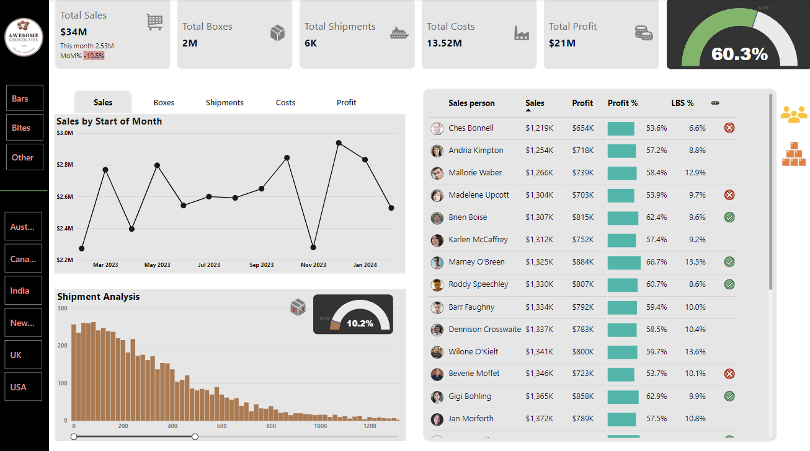

# Sales-Analytics-Dashboard

This repository contains the code and assets for the Sales Performance Dashboard, a data visualization tool designed to provide insights into key business metrics, including sales, shipments, costs, and profits.

### Features

  * Comprehensive Overview: Displays metrics like total sales, total shipments, total costs, and total profit.
  
  * Interactive Visualizations: Includes dynamic line charts, bar graphs, and percentage gauges for performance tracking.
  
  * Regional Filters: Allows filtering of sales data by regions such as Australia, Canada, India, the UK, and the USA.
    
  * Detailed Salesperson Analysis: Highlights individual salesperson performance with metrics like sales, profit, profit percentage, and weight contribution.
    
  * Shipment Analysis: Visualizes shipment trends over time, helping to identify patterns and operational efficiencies.

### Tools and Technologies

  * Power BI: Used for creating the dashboard and visualizations.

  * Data Sources: CSV/Excel data files for sales, shipment, and performance metrics.
    
  * Languages: DAX (Data Analysis Expressions) and M Query for data modeling.

See the full dashboard here - [App Power BI link](https://app.powerbi.com/view?r=eyJrIjoiNmY1OTcyMTgtZGNkZi00NzMzLWFhZTEtYTdlMzBmNGE0N2ZjIiwidCI6IjI4MWYwYTc5LWEwYzItNDAxYy04YTRmLTRmNjU1MGVhZjE1ZSJ9)

